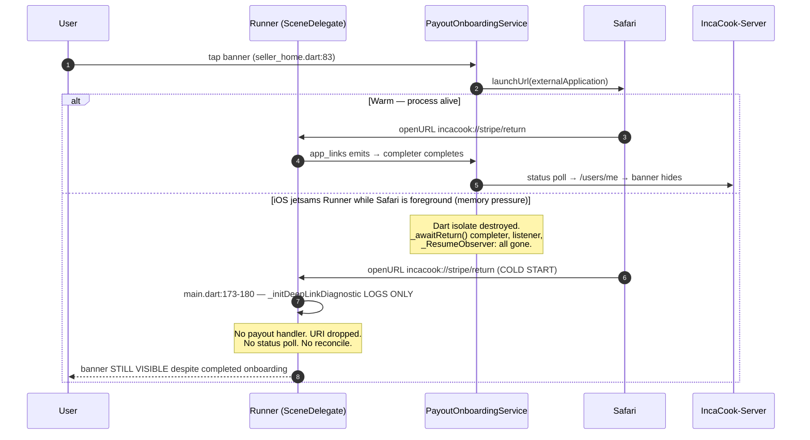

# Findings — Trace Connect onboarding and payout readiness on Android and iOS

- **Ticket:** `.agent-board/mobile/01-connect-onboarding-return.md`
- **GitHub:** [issue #4](https://github.com/ProgixDev/incacook-app/issues/4)
- **Mode:** AFK research — read-only. No source file in any repo was modified.
- **Repos read:** `IncaCook` (branch `feat/delivery-order-detail-suivi`),
  `IncaCook-Server` (branch `dev`, dirty worktree preserved), `incacook-admin`.
- **Secrets:** none copied. Only key *prefixes* (`sk_test_…`, `whsec_…`),
  endpoint identity, and modes are recorded.

## 0. Answer to the ticket question, up front

**No.** Onboarding return is reliable only on the *warm-return* path while the
Dart future launched by `openOnboarding` is still alive. Payout readiness is
persisted correctly, and the live `accounts.retrieve` poll is a genuinely good
design that removes the webhook dependency for the happy path. But:

1. A **seller whose subscription has lapsed has no reachable payout setup at
   all** — every seller entry point is either behind `SubscriptionGate` or
   driver-only (D1). This is the highest-severity finding.
2. **Cold start / process death loses the return entirely** — the
   `incacook://stripe/return` deep link has no listener outside the in-flight
   future, and `main.dart` only *logs* it (D2).
3. **`account.updated` has no event-ordering guard**, so an out-of-order
   redelivery can flip payout readiness back to `false` (D5).

Everything below is evidence for those claims.

---

## 1. Entry-point inventory

`PayoutOnboardingService.openOnboarding` has exactly **five** call sites
(exhaustive — `grep -rn "PayoutOnboardingService" lib`):

| # | Role | Entry point | Reachable? | file:line | State consumed |
|---|---|---|---|---|---|
| E1 | Driver | Signup wizard, optional `payoutSetup` step | **Yes** — always last driver step, skippable | `lib/features/authentication/presentation/screens/signup_flow/shared/payout_setup_page.dart:65`; step added at `lib/features/authentication/controllers/signup_flow_controller.dart:377-382`; "Continuer" always enabled at `signup_flow_controller.dart:595-598` | none (page is unconditional) |
| E2 | Driver | Delivery home banner | **Yes** — no gate | `lib/features/delivery/presentation/screens/delivery_home.dart:519-522`; tap → `:205` | `UserController.driverPayoutReady` (`lib/core/controllers/user_controller.dart:107-108`) |
| E3 | Driver | Delivery sheet → Settings tab → "Configurer mes paiements" row | **Yes** — no gate | `lib/features/delivery/presentation/widgets/delivery_settings_section.dart:57-66`; tap → `:25` | `driverPayoutReady` (`user_controller.dart:107-108`) |
| E4 | Driver | Wallet screen setup card | **Yes** for drivers | `lib/features/wallet/presentation/wallet_screen.dart:110-117`; tap → `:44` | `UserController.driverNeedsPayoutSetup` (`user_controller.dart:112-115`) — **`driverAccount != null && !completed`, so structurally driver-only** |
| E5 | Seller | Seller home banner | **Only while subscription is ACTIVE/TRIALING** | `lib/features/seller/presentation/screens/seller_home.dart:72-89`; tap → `:126`; wrapped at `lib/features/seller/presentation/seller_nav_tabs.dart:19` | `UserController.sellerPayoutReady` (`user_controller.dart:102-103`) |
| E6 | Seller | **Documented** Profil → settings → Stripe Connect payout | **NO — does not exist** | Claimed by `docs/qa/full-user-journey-testing.md:126-130`. No payout code in `lib/features/seller/presentation/screens/seller_profile.dart` (only imports `seller_menu_section.dart`), none in `lib/features/seller/presentation/widgets/seller_menu_section.dart`, none in `lib/features/settings/presentation/screens/settings.dart` (seller sees only the Wallet link at `:102-111`) | — |

### 1.1 Verdict on E6: is it missing, stale, or intentionally replaced?

The ticket asks me to state which. **The evidence is genuinely contradictory,
and I will not pick a side — this is issue #3's decision.** What I can prove:

- **The QA doc asserts it exists**: `docs/qa/full-user-journey-testing.md:126-130`
  — "**Profil** tab → settings → **Stripe Connect payout** setup".
- **The code does not have it**, per the exhaustive grep above.
- **`SubscriptionGate`'s own doc comment also asserts it exists**, independently
  of the QA doc: *"the Profil tab is intentionally left ungated so settings +
  payout onboarding stay reachable"* —
  `lib/features/subscriptions/presentation/widgets/subscription_gate.dart:8-13`.
  This is the load-bearing sentence, so quoting it exactly:

  ```dart
  /// Wraps a seller-only feature screen. Reactively shows the paywall when
  /// the seller's $4/mo subscription is inactive, and the real [child] once
  /// it's active. Used for the Accueil / Commandes / Catalogue tabs; the
  /// Profil tab is intentionally left ungated so settings + payout
  /// onboarding stay reachable. The backend enforces the same gate, so this
  /// is UX, not security.
  ```

So **two independent artifacts** (QA doc, and the gate's own rationale) describe
a seller Profil payout path, and the gate's ungating decision was *justified by*
that path. That is stronger than "stale documentation" — the ungating of Profil
is now load-bearing for nothing.

- **Counter-evidence for "intentionally replaced"**:
  `lib/features/authentication/data/models/signup_step.dart:30-32` says the
  seller subscription step *"Replaces payout setup for sellers"*. But that
  comment is *also* stale: the `sellerSubscription` step is **never added to the
  seller step list** (`signup_flow_controller.dart:355-366` explicitly says the
  subscription is "intentionally NOT a signup step"), so
  `SignupStep.sellerSubscription` and `SellerSubscriptionPage` are **dead code**
  reachable from no flow. A comment inside dead code is weak evidence of intent.

**Conclusion I can defend:** E6 is a *missing implementation whose absence was
not noticed because three separate comments assume it exists*. Whether the fix
is "add the Profil path" or "accept the home banner and re-gate accordingly" is
a product decision → §7, Q1.

### 1.2 Payout readiness is correctly separated from the other four states

The ticket insists these are distinct. The code **does** get this right, and I
want to record that as a positive finding:

| Concept | Source of truth | Evidence |
|---|---|---|
| **Payout readiness** | `payouts_enabled && details_submitted` — deliberately *not* `charges_enabled`, because IncaCook charges on the platform account and transfers out | `IncaCook-Server/src/modules/payments/onboarding/onboarding.service.ts:39-46` |
| **Signup completion** | `SignupStep` list; payout step is skippable and "Not a backend onboarding step" | `signup_step.dart:44-46`, `signup_flow_controller.dart:595-598` |
| **KYC state** | `kycStatus == APPROVED` — the *only* claim gate | `user_controller.dart:121-122`; backend `IncaCook-Server/src/modules/deliveries/deliveries.service.ts:583-593` |
| **Driver claim eligibility** | KYC only; payout explicitly NOT required — enforced at cashout instead | `deliveries.service.ts:594-600` ("Stripe Connect onboarding is deliberately NOT required to claim… cashout will be blocked until payout setup") |
| **Seller subscription entitlement** | date/status, not a re-charge | `user_controller.dart:134-144`; `subscription_gate.dart:22-30` |

Payout readiness is enforced at withdrawal only:
`IncaCook-Server/src/modules/wallets/wallets.service.ts:460-467` →
`ErrorCodes.PayoutSetupRequired`.

---

## 2. The full state chain (both platforms)

```
Banner/row tap
  → PayoutOnboardingService.openOnboarding()            payout_onboarding_service.dart:28
  → POST /v1/stripe/onboarding/account-link  (≤3 tries, transport-only retry)   :82-100
      → OnboardingController.createAccountLink          onboarding.controller.ts:20-26
      → OnboardingService.createAccountLink             onboarding.service.ts:65-106
          → accounts.create(type:'express', metadata:{userId, role})   :206-242
          → accountLinks.create(return_url, refresh_url)               :159-167
  → launchUrl(externalApplication)                      payout_onboarding_service.dart:32
  → [Stripe hosted onboarding, system browser]
  → GET https://…/v1/stripe/return  (https bridge; Stripe rejects custom schemes)
      → StripeReturnController.handleReturn             stripe-return.controller.ts:22-26
      → HTML meta-refresh + location.replace → incacook://stripe/return   :37,43,55
  → app_links delivers URI  →  _awaitReturn() completer  payout_onboarding_service.dart:112-118
      (OR: any AppLifecycleState.resumed also completes it)              :108,184-185
  → _reconcilePayoutStatus(): poll GET /v1/stripe/onboarding/status ×6, 2s apart  :139-163
      → OnboardingService.getStatus                     onboarding.service.ts:114-156
      → accounts.retrieve → persist stripeOnboardingCompleted (updateMany)   :143-148
  → UserController.refreshFromServer() → GET /users/me   payout_onboarding_service.dart:165
      → UserResponseDto ← seller-profile-response.dto.ts:63,108
                        ← driver-profile-response.dto.ts:22,41
  → UserController.setUser → Rxn<User> → Obx rebuild     user_controller.dart:150-155
  → banners re-evaluate (E2/E3/E4/E5)
```

Out-of-band, and **not** required for the happy path:
`account.updated` → `stripe-webhook-handler.service.ts:47-53` → `:435-473` →
`updateSellerOnboarding`/`updateDriverOnboarding` (`:475-487`).

### 2.1 Platform wiring

| | Android | iOS |
|---|---|---|
| Scheme registration | intent-filter `scheme=incacook`, `host=stripe`, **no path** (so `/return` and `/refresh` both match) — `android/app/src/main/AndroidManifest.xml:71-78` | `CFBundleURLSchemes = incacook` — `ios/Runner/Info.plist:41-48`. No host/path filtering exists on iOS; the scheme alone routes. |
| Activity launch mode | `singleTop` — `AndroidManifest.xml:37` | n/a |
| Flutter deep-link auto-routing | `flutter_deeplinking_enabled = false` — `AndroidManifest.xml:48` | `FlutterDeepLinkingEnabled = false` — `Info.plist:62-63` |
| Browser visibility | `<queries>` declares browsable https VIEW — `AndroidManifest.xml:97-103` | n/a |

Both are **correct and consistent** for the warm path. `singleTop` + a live
Flutter engine means the return delivers to the existing activity via
`onNewIntent`, not a fresh one — the right choice. Deep-link auto-routing is
disabled on both, deliberately (GetX has no matching route), which is why the
URI must be consumed by an `app_links` listener — see D2 for the consequence.

### 2.2 Sequence — Android, warm return (the working path)

```mermaid
sequenceDiagram
    autonumber
    participant U as User
    participant A as MainActivity (singleTop)
    participant F as PayoutOnboardingService
    participant B as Chrome (external)
    participant S as Stripe hosted
    participant API as IncaCook-Server
    U->>F: tap banner (delivery_home.dart:522)
    F->>API: POST /v1/stripe/onboarding/account-link
    API->>S: accounts.create + accountLinks.create
    API-->>F: {url, expiresAt}
    F->>B: launchUrl(externalApplication)
    Note over A: onPause → onStop
    F->>F: _awaitReturn(): app_links listener + _ResumeObserver
    U->>S: completes KYB / bank details
    S->>B: 302 → https://…/v1/stripe/return
    B->>API: GET /v1/stripe/return
    API-->>B: HTML meta-refresh → incacook://stripe/return
    B->>A: VIEW intent (host=stripe) → onNewIntent
    Note over A: onResume — BOTH triggers fire; completer is guarded (:114-117)
    A->>F: uriLinkStream emits
    F->>API: GET /v1/stripe/onboarding/status (×≤6, 2s apart)
    API->>S: accounts.retrieve
    API->>API: persist stripeOnboardingCompleted
    API-->>F: {onboardingCompleted:true,…}
    F->>API: GET /users/me
    API-->>F: User{driverAccount.stripeOnboardingCompleted:true}
    F->>A: setUser → Obx → banner hides
```

### 2.3 Sequence — iOS, and the cold-start divergence (D2)



---

## 3. Race / lifecycle matrix

Verdicts: **correct** = code provably handles it; **broken** = code provably
mishandles it; **unproven** = cannot be settled by reading code, needs a device.

| # | Scenario | What the code actually does today | Verdict | Evidence |
|---|---|---|---|---|
| R1 | **Warm foreground return** | `app_links` URI *and* `_ResumeObserver` both race to `completer.complete()`; `!completer.isCompleted` guards both. Poll then `/users/me`. Banner hides via `Obx`. | **correct** | `payout_onboarding_service.dart:105-130`, `:112-117`, `:184-185` |
| R2 | **Background resume** (no deep link, user swipes back to app) | `_ResumeObserver` fires on `resumed` → reconcile runs anyway. This is a deliberate belt-and-braces design and it works. | **correct** | `payout_onboarding_service.dart:108-110`, `:119` |
| R3 | **Cold start after process death** (app killed while browser open) | **Return is silently lost.** The only global `app_links` listener is `_initDeepLinkDiagnostic`, which calls `logError` and nothing else. No payout handler, no reconcile-on-boot. Nothing calls `refreshFromServer` on cold start for payout purposes. Banner stays wrong until an unrelated refresh. | **broken** (D2) | `lib/main.dart:166-181` (logs only); `grep refreshFromServer` shows no boot/resume hook; `payout_onboarding_service.dart:105` is the *only* consumer of `incacook://stripe/*` |
| R4 | **Duplicate callback** (link tapped twice, or fallback `<a>` tapped after meta-refresh already fired) | `!completer.isCompleted` makes the 2nd delivery a no-op **while the future is live**. Backend `getStatus` is naturally idempotent (`accounts.retrieve` + `updateMany`). After the future completes, a 2nd URI is dropped (same root cause as R3) but harmless. | **correct** | `payout_onboarding_service.dart:114-117`; `onboarding.service.ts:136-149` |
| R5 | **User cancellation** (backs out of Stripe without finishing) | `resumed` fires → poll runs 6×2s → `onboardingCompleted:false` every time → **12s of polling** → `/users/me` → banner correctly stays. Correct outcome, but the loop never short-circuits on a definitive "user bailed" signal and there is no spinner/feedback for those 12s. | **correct (outcome); poor UX** | `payout_onboarding_service.dart:140-163` — `break` only on `completed`, else always `await 2s` |
| R6 | **Refresh-link path** (Stripe link expired → hits `refresh_url`) | Bridge serves `incacook://stripe/refresh` — same `host=stripe`, so Android's filter matches and `_awaitReturn` completes on it. **But `_awaitReturn` does not read `uri.path`**: it treats `refresh` identically to `return`. So an *expired-link* bounce is reported to the user as a completed-but-incomplete onboarding: poll returns false, banner stays, **no new link is minted, no message shown**. The user is dumped back with no explanation. | **broken** (D3) | `payout_onboarding_service.dart:113-115` matches only `scheme`+`host`, ignores `uri.path`; `stripe-return.controller.ts:29-32,37` emits `/refresh`; `AndroidManifest.xml:71-78` has no path filter |
| R7 | **Slow Stripe settlement** (account not yet `payouts_enabled` at return) | Poll gives it **≤12s** (6 × 2s, fixed, no backoff). If Stripe settles at t+13s, the poll gives up, `/users/me` reads the stale `false`, banner stays. Recovery then depends entirely on `account.updated` (D5) or a manual pull-to-refresh. | **broken/insufficient** (D4) | `payout_onboarding_service.dart:140`, `:162` |
| R8 | **Missed `account.updated`** | The live poll is the *primary* path, so a missed webhook is survivable **at return time** — this is the design's main strength. It is **not** survivable for later transitions (Stripe enabling payouts at t+1h, or *disabling* them) because nothing re-reads live Stripe outside `openOnboarding`. | **partially correct** | poll: `payout_onboarding_service.dart:139-163`; webhook: `stripe-webhook-handler.service.ts:435-473` |
| R9 | **Out-of-order `account.updated` redelivery** | `handleAccountUpdated` recomputes the boolean from `event.data.object` and does a bare `updateMany` with **no `event.created` comparison and no version/timestamp guard**. The dispatcher docstring calls this "idempotent … last-write-wins" — but last-write-wins is only safe if delivery is ordered, and **Stripe does not guarantee ordering**. An older `payouts_enabled:false` event landing after a newer `true` **flips readiness back to false** → banner reappears, withdrawals blocked. | **broken** (D5) | `stripe-webhook-handler.service.ts:47-53` (docstring), `:435-437`, `:475-487` |
| R10 | **Offline return** | `_reconcilePayoutStatus` catches the failed `status` call, logs, and **`break`s out of the poll immediately** (`:156-160`) — it does not retry. Then `refreshFromServer` also throws, is caught and logged (`:166-168`). Net: **silent no-op, no user-visible error**, banner stays. The user sees nothing and has no idea they must retry. | **broken (silent)** (D6) | `payout_onboarding_service.dart:156-168` |
| R11 | **Reopen app later** (hours after completing onboarding) | Seller: pull-to-refresh on home calls `refreshFromServer` (`seller_home.dart:31`) → recovers. Driver: `delivery_home.dart:92` refreshes on init → recovers. Settings screen also refreshes (`settings.dart:50`). So **reopening does eventually self-heal** *provided* the DB flag is right (i.e. provided the webhook landed, since the poll is long gone). | **correct, by luck of unrelated refreshes** | `seller_home.dart:28-34`, `delivery_home.dart:89-95`, `settings.dart:50` |
| R12 | **Stripe later disables payouts** (restricted account, doc expiry) | Only `account.updated` can write `false` back. If that webhook is missed, `stripeOnboardingCompleted` stays `true` forever: banner stays hidden, withdrawal proceeds to `transfers.create` (`wallets.service.ts:473`) and fails at Stripe with a raw error. Nothing re-reads live Stripe on a withdrawal. | **broken** (D7) | `wallets.service.ts:460-467` reads the persisted flag only; `:516-537`; no live `accounts.retrieve` anywhere outside `onboarding.service.ts:137` |
| R13 | **`launchUrl` returns true but no browser actually takes foreground** | `_awaitReturn` is armed *after* `launchUrl` returns (`:32` then `:44`). If any transient `resumed` reaches the observer before the browser takes over, the completer completes instantly, the poll burns 12s against a not-yet-started onboarding, and the **real** return later finds no listener (→ R3). | **unproven — needs a device** | ordering at `payout_onboarding_service.dart:32,44,105-130` |
| R14 | **Android back-button return** (no deep link, user hits Back from Chrome) | `onNewIntent` never fires, but `_ResumeObserver` does → reconcile runs. Same as R2. | **correct** | `payout_onboarding_service.dart:108-110` |
| R15 | **5-minute timeout** | `completer.future.timeout(5 min, onTimeout: () {})` → swallows, then **`_reconcilePayoutStatus` runs anyway** while the user may still be mid-onboarding in the browser. Poll fires 6 requests over 12s from a *backgrounded* app, all returning false. Harmless but wasteful; and it means the future is dead for the real return (→ R3). | **broken (minor)** | `payout_onboarding_service.dart:122-125`, then `:44-45` |

---

## 4. Defects and hypotheses

Each carries a **falsifiable statement** — the thing that would have to be
observed for the defect to be real (or for me to be wrong).

### D1 — Seller with a lapsed subscription is locked out of payout setup entirely (**highest severity**)

Every seller payout entry point fails simultaneously for a lapsed seller:

- E5 home banner is inside `SubscriptionGate(child: SellerHomeScreen())` →
  `seller_nav_tabs.dart:19`. Inactive sub → `SubscriptionPaywallScreen` replaces
  the whole tab → banner unreachable (`subscription_gate.dart:30`).
- E6 Profil path does not exist (§1.1).
- E4 Wallet card is `driverNeedsPayoutSetup` = `driverAccount != null && …`
  (`user_controller.dart:112-115`). A seller's `driverAccount` is `null` → **the
  card never renders for a seller**, even though the Wallet screen *is* reachable
  for sellers (`settings.dart:102-111` gates the Wallet link on
  `isEarner = seller || driver`).

The trap closes: the seller **can** open Wallet and **can** tap Withdraw, and the
backend rejects it with `INCACOOK_PAYOUT_SETUP_REQUIRED` / *"Configurez vos
paiements pour retirer vos gains"* (`wallets.service.ts:460-467`) — an error
that instructs the user to do something the UI gives them no way to do.

> **Falsifiable:** a seller with `subscriptionStatus=EXPIRED` and
> `stripeOnboardingCompleted=false` who has earnings can reach *no* control that
> calls `openOnboarding`, yet Withdraw returns `PAYOUT_SETUP_REQUIRED`. If any
> reachable seller-side control opens Connect onboarding while the sub is
> lapsed, D1 is wrong.

Note the ordering hazard that makes this reachable in production: sellers earn
*before* paying (subscription is deliberately not a signup step —
`signup_flow_controller.dart:361-366`), so "has a wallet balance but no active
sub" is a **normal, expected state**, not an edge case.

### D2 — Cold-start return is dropped; `incacook://stripe/*` has no global handler

`main.dart:166-181` is the only always-on `app_links` listener and it is a
diagnostic: it calls `logError` and returns. The sole payout consumer is the
short-lived listener inside `_awaitReturn` (`payout_onboarding_service.dart:112`),
which dies with the isolate (or after the 5-min timeout, R15).

> **Falsifiable:** kill the app while Stripe's page is open, complete onboarding,
> let the browser deep-link into a cold start → logs show `[DeepLink] received:
> incacook://stripe/return` but **no** `[Payout] status …` line, and the banner is
> still displayed on the first frame. If a `[Payout] status` line appears, D2 is
> wrong.

Note this is *masked* on the driver side by `delivery_home.dart:92`'s unrelated
init refresh — but only if the DB flag was already written by the webhook. With
the webhook missed (R8), the cold-start user is stuck with a wrong banner and
**no** code path that can fix it except tapping the banner again.

### D3 — `refresh_url` is treated as a successful return

`_awaitReturn` matches `uri.scheme == 'incacook' && uri.host == 'stripe'` and
**never inspects `uri.path`** (`payout_onboarding_service.dart:113-115`), while
the bridge deliberately encodes the distinction in the path
(`stripe-return.controller.ts:37` → `incacook://stripe/${kind}`). The
backend went to the trouble of building two distinct routes (`:23`, `:30`) and
the client throws the distinction away.

Stripe hits `refresh_url` when the Account Link has **expired** or is otherwise
invalid. The correct response is to mint a new link and re-open it. The actual
response is to poll for a status that cannot possibly have changed and leave the
banner up, silently.

> **Falsifiable:** mint an Account Link, wait for expiry (or hit the
> `refresh_url` directly), open it → app receives `incacook://stripe/refresh`,
> logs `[Payout] status completed=false` ×6, no new `account-link` POST is
> issued, no message shown. If a fresh link is minted, D3 is wrong.

### D4 — Poll window (12s) is too short and un-tuned for slow settlement

`for (var attempt = 0; attempt < 6; attempt++)` with a **fixed** 2s sleep
(`payout_onboarding_service.dart:140`, `:162`) = 12s worst case. The code's own
comment acknowledges the problem ("Android can resume the app before Stripe's
account object has fully settled") but 12s with no exponential backoff is a
guess, not a measured bound.

> **Falsifiable:** instrument `getStatus` server-side and record the p95 delay
> between `return_url` hit and `payouts_enabled:true` on `accounts.retrieve` for
> real test accounts. If p95 > 12s, D4 is real. **This needs data I do not have**
> (see §8).

### D5 — `account.updated` has no ordering guard; stale event can revoke payout readiness

`handleAccountUpdated` (`stripe-webhook-handler.service.ts:435-437`) recomputes
the flag from `event.data.object` and writes it unconditionally (`:475-487`).
The dispatcher docstring (`:44-48`) claims idempotency via "last-write-wins" —
but **Stripe does not guarantee event ordering**, and last-write-wins over an
unordered stream is not idempotent, it is racy. There is no comparison against
`event.created`, no `updatedAt` guard, and no stored event id.

Concretely: Stripe emits `account.updated` several times during onboarding
(`details_submitted:true, payouts_enabled:false` → then `payouts_enabled:true`).
A retry of the *first* event delivered after the second flips the seller/driver
back to "not onboarded" — banner reappears, withdrawals start 403-ing, and
**nothing corrects it** except the user tapping the banner again.

> **Falsifiable:** replay an older `account.updated` (with
> `payouts_enabled:false`) after a newer one via the Stripe CLI → the profile's
> `stripeOnboardingCompleted` flips `true → false`. If the write is rejected or
> ignored, D5 is wrong.

Contrast with `handleChargeback`, which *does* have a dedupe test
(`stripe-webhook-handler.chargeback.spec.ts:84`) — the pattern exists in the
codebase, it just was not applied here.

### D6 — Offline / failed return fails silently

`_reconcilePayoutStatus`'s catch does `break` on the *first* failure
(`payout_onboarding_service.dart:156-161`) — a single transient blip abandons the
whole poll. Then `refreshFromServer`'s failure is also swallowed (`:164-168`).
Both log; neither surfaces anything. `openOnboarding` still returns `true`
(`:46`), because the return value means "the hosted page was opened" (`:27`),
not "onboarding reconciled" — every caller ignores the value anyway.

Note the asymmetry: `openOnboarding` retries **3×** with backoff to *open* the
link (`:76-100`, because a cold Railway instance may stall) but the return-side
status call gets **zero** retries against the same cold instance.

> **Falsifiable:** enable airplane mode at the moment of return → no SnackBar,
> no error UI, banner unchanged, only `[Payout] status refresh failed` in logs.
> If any user-visible feedback appears, D6 is wrong.

### D7 — Loss of payout capability is invisible to the withdrawal gate

`requestWithdrawal` reads the **persisted** flag (`wallets.service.ts:460-467`
via `resolvePayoutTarget` `:516-537`) and never re-reads live Stripe. If
`account.updated` is missed (or reverted per D5) when Stripe restricts an
account, the flag stays `true`, the gate passes, and `transfers.create`
(`:473`) fails at the Stripe API with whatever raw error surfaces.

> **Falsifiable:** restrict a Connect test account in the dashboard, block the
> webhook, then request a withdrawal → the gate passes and the transfer throws.
> If the gate rejects first, D7 is wrong.

### D8 — Stale comments and dead code around this flow (low severity, high confusion cost)

These are worth fixing because **they are what made E6 invisible**:

| Claim | Reality |
|---|---|
| `subscription_gate.dart:11-12` "Profil tab … so settings + **payout onboarding** stay reachable" | No payout onboarding in Profil (§1.1) |
| `signup_step.dart:44-46` payoutSetup is "**Shared (seller + driver)**" | Driver-only — `signup_flow_controller.dart:377-382`; seller branch `:355-366` never adds it |
| `signup_step.dart:30-32` `sellerSubscription` "Replaces payout setup for sellers" | `sellerSubscription` is **never added to any step list** → dead enum + dead `SellerSubscriptionPage` |
| `payout_setup_banner.dart:11-15` "The banner is a **skeleton** today — visuals only, **no Stripe wiring**… (wired once `StripeConnectService` lands)" | Fully wired; `StripeConnectService` never existed (it became `PayoutOnboardingService`) |
| `IncaCook-Server/docs/BACKEND_SCHEMA.md:619-620` deep links are `incacook://payout/return` + `incacook://payout/refresh` | Actual scheme is `incacook://stripe/return|refresh` (`stripe-return.controller.ts:37`; `AndroidManifest.xml:76-77`). **The documented host would not match the intent filter.** |
| `docs/qa/full-user-journey-testing.md:126-130` seller Profil → payout | Does not exist (§1.1) |

### D9 — Deployed return-URL host divergence (flagging only — owned by backend/01)

`.env` and `.env.railway.api.local` point `STRIPE_ONBOARDING_RETURN_URL` at
**two different Railway hosts** (`incacook-api-production…` vs
`incacook-api-production-146b…`). Both are `sk_test_` mode. If the Account Link
is minted by an instance whose configured `return_url` points at the *other*
deployment, the bridge still works (it is `@Public()`,
`stripe-return.controller.ts:22`) — but this is exactly the kind of drift that
makes a return "sometimes work". **Defer to `backend/01-deployed-connect-configuration.md`**;
recorded here only because it materially affects R3/R6 reproduction.

---

## 5. Proposed tests (NOT written — proposals only, per the ticket's Test boundary)

### 5.1 Automated service/state tests — "polling and reconciliation update the cached user and every role-specific consumer without requiring a restart"

Mobile (`test/features/payments/`), with a fake `ApiClient` + fake `AppLinks` stream.
This requires a **seam that does not exist today**: `PayoutOnboardingService` is
a static class with `const PayoutOnboardingService._()` and hard-wired
`ApiClient.instance` / `AppLinks()` / `launchUrl`
(`payout_onboarding_service.dart:22-23, 32, 85, 107, 142`). **Introducing that
seam is itself an implementation slice** and is a prerequisite for T1-T6.

- **T1** `status` returns `completed:true` on poll #1 → exactly one `/users/me`;
  `UserController.driverPayoutReady` flips `false→true` with no restart.
- **T2** `status` returns false ×3 then true → poll stops at the true (asserts
  the `break` at `:154`), total ≤ 6 attempts.
- **T3** all 6 polls false → `/users/me` still called once (asserts the
  fall-through at `:164`); `driverPayoutReady` stays `false`; banner stays.
- **T4** **Consumer fan-out** (the ticket's "every role-specific consumer"):
  after reconcile, assert in one widget test per consumer that the `Obx`
  rebuilds and the control disappears — E2 `delivery_home.dart:519-522`,
  E3 `delivery_settings_section.dart:57-66`, E4 `wallet_screen.dart:110-117`,
  E5 `seller_home.dart:72-89`.
- **T5** **Would fail today (D1)**: seller with `subscriptionActive:false` and
  `stripeOnboardingCompleted:false` → assert at least one reachable widget in
  the seller tree exposes an `openOnboarding` callback. *Write this only after
  issue #3 decides the intended flow* — the assertion's shape IS the decision.
- **T6** **Would fail today (D3)**: feed `incacook://stripe/refresh` → assert a
  **second** `POST /account-link` is issued. Feed `incacook://stripe/return` →
  assert **no** second POST.
- **T7** state-only, no seam needed: `driverNeedsPayoutSetup` (`user_controller.dart:112-115`)
  returns `false` for a seller with `stripeOnboardingCompleted:false` —
  documents D1's `driverAccount != null` cause as a characterization test.

### 5.2 Contract tests — backend (`onboarding.service.spec.ts` already exists; extend it)

Existing coverage is only Stripe *error mapping* + one happy path
(`onboarding.service.spec.ts:69-104`). Gaps:

- **C1 stale `/users/me`**: `accounts.retrieve` → `payouts_enabled:true` while DB
  says `false` → `getStatus` persists `true` **and** a subsequent `/users/me`
  serializes `true` (proves `onboarding.service.ts:143-148` → `seller-profile-response.dto.ts:108`).
- **C2 delayed/missed webhook recovery**: never deliver `account.updated`; call
  `getStatus` → DB reconciles anyway. (This is the design's core claim — it is
  currently **untested**.)
- **C3 duplicate callback**: `getStatus` ×2 → same result, `updateMany` idempotent,
  no duplicate side effects.
- **C4 cancellation**: `details_submitted:true, payouts_enabled:false` →
  `onboardingCompleted:false` (guards the `&&` at `onboarding.service.ts:44-46`).
- **C5 loss of payout capability**: DB `true`, live `payouts_enabled:false` →
  `getStatus` **writes `false` back**. Asserts the demotion direction, which is
  only implicitly covered today.
- **C6 out-of-order `account.updated` (D5)**: deliver `created:100 (true)` then
  `created:50 (false)` → assert final state is `true`. **Fails today.**
- **C7 no-such-account recovery**: `resource_missing` → `getStatus` returns
  not-onboarded rather than 503 (`onboarding.service.ts:150-154`), and
  `createAccountLink` recreates once (`:92-100`).
- **C8 withdrawal gate (D7)**: restricted account + stale `true` flag → decide
  whether `requestWithdrawal` should re-read live Stripe before
  `transfers.create` (`wallets.service.ts:460-473`).
- **C9 bridge contract**: `GET /v1/stripe/return` and `/refresh` are `@Public()`,
  return `text/html`, and contain **exactly** `incacook://stripe/return` /
  `incacook://stripe/refresh`. This is the doc-drift canary for D8/BACKEND_SCHEMA.

---

## 6. Android / iOS device QA case matrix

Per the ticket: *"passes only when the chosen setup action is reachable, the
banner hides after authoritative payout readiness, remains visible while
incomplete, and reappears if Stripe later disables payouts."*

Run every case on **Android** and **iOS**. Seller rows marked ⛔ are **blocked on
issue #3** — the pass criterion cannot be written until the intended flow is
decided.

| ID | Role | Entry | Lifecycle case | Pass criterion | Expected today |
|---|---|---|---|---|---|
| Q1 | Driver | E1 signup | Complete in browser, warm return | Lands on delivery home, banner absent | pass |
| Q2 | Driver | E1 signup | Skip ("Continuer") | Banner present on delivery home | pass |
| Q3 | Driver | E2 banner | Warm return, complete | Banner hides with no restart | pass |
| Q4 | Driver | E2 banner | Back-button out of Chrome (no deep link) | Banner stays (incomplete) | pass (R14) |
| Q5 | Driver | E2 banner | **Kill app while browser open**, complete, cold start | Banner hides | **FAIL (D2)** |
| Q6 | Driver | E3 settings row | Warm return, complete | Row disappears | pass |
| Q7 | Driver | E4 wallet card | Warm return, complete | Card hides; Withdraw enabled | pass |
| Q8 | Driver | E2 | **Expired link → `refresh_url`** | New link minted + reopened | **FAIL (D3)** |
| Q9 | Driver | E2 | Airplane mode at return | User-visible error + retry affordance | **FAIL (D6)** |
| Q10 | Driver | E2 | Deep link delivered twice | Single reconcile, no double POST | pass (R4) |
| Q11 | Driver | E2 | Slow settlement (>12s) | Banner eventually hides without manual action | **FAIL (D4)** — needs measurement |
| Q12 | Driver | E2 | Stripe **disables** payouts later (dashboard restrict) | Banner **reappears** | **FAIL if webhook missed (D7/R12)** |
| Q13 | Driver | E2 | Replay stale `account.updated` (Stripe CLI) | Readiness does **not** regress | **FAIL (D5)** |
| Q14 | Driver | — | KYC `PENDING`, payout complete | "Accepter" **disabled** (KYC gate), banner hidden | pass — proves the KYC/payout separation (`deliveries.service.ts:583-600`) |
| Q15 | Driver | — | KYC `APPROVED`, payout incomplete | "Accepter" **enabled**; Withdraw **blocked** | pass — proves claim ≠ payout |
| Q16 | Seller | E5 banner | Active sub, warm return, complete | Banner hides | pass |
| Q17 | Seller | E5 | Active sub, cold start return | Banner hides | **FAIL (D2)**; masked by pull-to-refresh (`seller_home.dart:31`) |
| Q18 | Seller ⛔ | E6 | **Lapsed sub**, has wallet balance, wants payout setup | *TBD by issue #3* | **FAIL (D1)** — no reachable control |
| Q19 | Seller ⛔ | E6 | Lapsed sub → tap Withdraw | *TBD by issue #3* | Backend says "Configurez vos paiements", UI offers no way to |
| Q20 | Both | — | iOS jetsam under memory pressure while Safari foreground | Banner correct on relaunch | **FAIL (D2)** — the realistic iOS trigger for R3 |

Device notes:
- Android `singleTop` (`AndroidManifest.xml:37`) means Q5 requires a **real
  process kill** (`adb shell am kill`), not just Back — Back gives Q4.
- iOS has no equivalent of Android's `host=stripe` filter (`Info.plist:41-48`
  registers the bare scheme), so Q8's `/refresh` reaches the app on both — D3 is
  a client-logic defect, not a platform-registration one.
- Q12/Q13 need Stripe dashboard + CLI access and a `sk_test_` Connect account.

---

## 7. Open decisions for issue #3

Issue #3 owns the seller-flow product decision. I have **not** treated code or
the QA doc as authoritative for any of these.

1. **Where does seller payout setup live?** The home banner behind
   `SubscriptionGate` (current code), the Profil → settings path (QA doc
   `:126-130` **and** `subscription_gate.dart:11-12`), or both? Until this is
   answered, D1 has no correct fix and Q18/Q19 have no pass criterion.
2. **Should payout setup be reachable to a lapsed-subscription seller?** I
   believe the answer must be **yes** — sellers can hold a wallet balance without
   an active sub (subscription is not a signup step,
   `signup_flow_controller.dart:361-366`), and the backend already tells them to
   configure payouts to withdraw (`wallets.service.ts:462-465`). But
   "entitlement to sell" vs "right to be paid what you already earned" is a
   product//possibly legal/ call, not mine.
3. **Is `SubscriptionGate`'s Profil-ungating rationale still valid?** It was
   justified by a payout path that does not exist. If the decision is "banner
   only", the comment should be corrected; if "Profil path", it should be built.
4. **Should `driverNeedsPayoutSetup` become role-agnostic** (`payoutNeedsSetup`)
   so the Wallet card serves sellers too (`user_controller.dart:112-115`)? This
   is the smallest possible fix for D1 — the Wallet screen is *already* reachable
   for sellers (`settings.dart:102-111`) — but it presupposes decision #1.
5. **Is `SignupStep.sellerSubscription` + `SellerSubscriptionPage` intended for
   revival, or should the dead code be deleted?** (`signup_step.dart:30-32`.)
6. **Should the driver signup payout step stay optional?** Currently skippable by
   design (`signup_flow_controller.dart:595-598`); confirm that is still wanted
   given payout is not needed to claim (`deliveries.service.ts:594-600`).

---

## 8. Unknowns / could not verify

Honest list — no padding.

- **Real Stripe timing (D4).** I cannot measure p95 settlement latency between
  the `return_url` hit and `payouts_enabled:true` by reading code. The 12s window
  may be fine or badly short. Needs an instrumented test account.
- **Whether `account.updated` is actually enabled on the deployed webhook
  endpoint.** The handler exists (`stripe-webhook-handler.service.ts:51`), but
  endpoint event-type subscription is dashboard config I did not access. Owned by
  `backend/01-deployed-connect-configuration.md`. If it is *not* subscribed, D7
  and R12 are permanent, not intermittent, and D5 is moot.
- **Which Railway host is live (D9).** Two different `STRIPE_ONBOARDING_RETURN_URL`
  hosts across `.env` files; I did not make network calls to determine the
  deployed value.
- **R13 (transient `resumed` before browser takeover).** Genuinely undecidable by
  reading — it depends on OEM browser behavior and Flutter engine lifecycle
  timing. Marked *unproven*, not *broken*. Needs a device with lifecycle logging.
- **iOS jetsam frequency (Q20).** That iOS *can* kill the app behind Safari is
  certain; how often it does for this app's memory profile is not something I
  measured.
- **`app_links` cold-start replay semantics.** `AppLinks().uriLinkStream` may or
  may not replay the launch URI to a listener attached later in `main()`. This
  matters for how D2 gets fixed (a global handler might Just Work, or might need
  `getInitialLink`). I did not read the plugin's source. **This does not affect
  whether D2 is real** — today there is no payout handler at all, only
  `logError` (`main.dart:174-180`).
- **Admin panel.** `incacook-admin` surfaces `stripeOnboardingCompleted` read-only
  in the driver drawer (`app/(dashboard)/drivers/_components/driver-drawer.tsx`,
  `driver-model.tsx`). No admin write path or reconcile trigger found; I did not
  audit it further as it is outside this ticket's scope.
- **No client incident notes found.** The ticket asks for "existing client
  incident notes"; `git log` across both repos surfaced only feature commits
  (`a8b6b9e` banner, `7a11e95` return flow, `94be9e9` "mark Connect onboarding
  complete on payouts + details" — the commit that established the
  `payouts_enabled && details_submitted` rule). No incident/postmortem docs exist.
