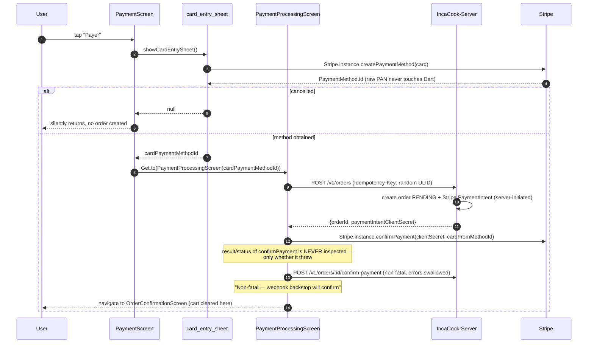

# Findings — Verify mobile PaymentSheet and order-payment recovery

- **Ticket:** GitHub [issue #10](https://github.com/ProgixDev/incacook-app/issues/10) — "Verify mobile
  PaymentSheet and order-payment recovery"
- **Depends on:** [issue #8](https://github.com/ProgixDev/incacook-app/issues/8) (backend order
  payment lifecycle) — treated as ground truth here, not re-verified. Summary of #8's findings:
  `handlePaymentIntentSucceeded` only transitions `PENDING→CONFIRMED` (idempotent, no-op on
  redelivery); `handlePaymentIntentFailed` restores inventory exactly-once inside a transaction that
  re-reads fresh state; chargebacks are idempotent per `stripeDisputeId`. Still open on #8: no
  live-Postgres e2e test across a crash boundary (Postgres unreachable in the investigating
  environment), and `charge.refunded` is a separate unhandled gap (K-4, finding 05) — neither affects
  the client-side findings below.
- **Mode:** AFK research — read-only. No source file in any repo was modified.
- **Repos read:** `IncaCook` (mobile), `IncaCook-Server` (backend, read-only cross-reference).
- **Secrets:** none copied.

## 0. Answer to the ticket question, up front

**Mostly yes, with one real money-risk gap.** The live checkout path (custom
card entry + `Stripe.instance.confirmPayment`, *not* the native
`flutter_stripe` `PaymentSheet` — that code exists but is unreachable dead
code, §1/§9) is internally consistent with the webhook-authoritative backend
confirmed by #8: the client's own post-payment confirm call is explicitly
non-fatal ("webhook backstop will confirm"), and no fake/mocked payment
bypass exists in the reachable app.

But:

1. **Duplicate-order risk (P1, highest severity)**: the client generates a
   fresh random idempotency key on every `createOrder()` call rather than
   persisting one per checkout attempt. Any retry that goes through a *new*
   `PaymentProcessingScreen` instance — backing out to "choose another
   method," or the app being killed and relaunched with the cart still
   populated — creates a second order, a second PaymentIntent, and a second
   inventory decrement for the same cart, with zero client-side or
   server-side protection against it.
2. **The seller supply-catalog purchase flow (Flow B) has no idempotency
   protection at all** (client or server) and, unlike the main checkout,
   treats a network failure on its post-payment confirm call as a hard
   failure shown to the user — even if Stripe already charged them (P5).
3. **Every failure mode funnels into one generic message** ("Ta carte a été
   refusée" / "your card was declined") regardless of actual cause — 3DS
   cancellation, sold-out inventory, network timeout, and an
   already-succeeded-but-retried PaymentIntent are all indistinguishable to
   the user (P3).
4. **No app-restart recovery exists** for an in-flight checkout — this
   matches the ticket's literal test boundary and is confirmed as a real gap,
   not a hypothesis (P6).

Everything below is evidence for those claims.

---

## 1. Full checkout sequence, client side — two independent implementations exist

### Flow A — buyer food checkout (the live, reachable path)

Key evidence:

- `PaymentScreen._pay()` (`payment.dart:42-87`), guarded by `if (_processing)
  return` (`:43`).
- `card_entry_sheet.dart:56-60` — tokenizes via
  `Stripe.instance.createPaymentMethod`; cancellation returns `null` and
  `payment.dart:56-59` returns early with **no order created and no error
  shown**.
- `PaymentProcessingScreen._runPayment()` (`payment_processing.dart:72-171`):
  order creation is server-initiated on `POST /v1/orders`
  (`orders.service.ts:330-368`, separate-charges pattern,
  `automatic_payment_methods: {enabled:true}`) — the client never creates a
  PaymentIntent itself.
- Confirmation calls `Stripe.instance.confirmPayment(...)` directly
  (`payment_processing.dart:120-127`) — **not** `presentPaymentSheet()`.
- The post-payment backend call
  (`OrdersRepository.instance.confirmPayment(_orderId!)`) is wrapped in its
  own `try/catch` that swallows all errors (`:139-145`).
- **No branch exists on the result of either call.** If neither throws, the
  code falls straight to navigation regardless of what either call actually
  returned — `confirmPayment`'s returned `PaymentIntent.status` is never
  read.
- `OrderConfirmationScreen.initState` clears the cart
  (`order_confirmation.dart:62`) — only on this path.

**The native `flutter_stripe` `PaymentSheet` path is unreachable dead code.**
`_presentPaymentSheet()` (`payment_processing.dart:176-185`) is only reached
via the `else` branch at `:128-132` when `cardPaymentMethodId == null` — but
`PaymentProcessingScreen` has exactly one construction site in the repo
(`payment.dart:63-72`), reached only *after* `payment.dart:56-59` has already
returned early on a null id. So by construction time,
`cardPaymentMethodId` is always non-null. Confirmed via repo-wide grep:
`PaymentProcessingScreen(` → 2 hits (declaration + the one call site);
`presentPaymentSheet` → 1 hit (`payment_processing.dart:184`, inside the dead
branch). The branch's own comment ("No pre-entered card (PayPal / Apple Pay /
wallet) → let Stripe's native sheet collect a method") describes a path with
no live entry — `card_entry_sheet.dart` has no PayPal/Apple Pay/wallet option.

`lib/features/checkout/presentation/screens/checkout.dart` (`CheckoutScreen`)
is a bare `Placeholder()` (lines 1-9) with **zero references anywhere else in
`lib/`** — a dead scaffold in a directory name that suggests it should be the
real checkout entry point, while the live checkout actually lives under
`features/orders/presentation/screens/`.

### Flow B — seller supply-catalog purchase (independent, materially weaker)

`supply_product_detail_screen.dart._buy()` → `SupplyCatalogRepository.createOrder()`
→ `Stripe.instance.confirmPayment()` → `SupplyCatalogRepository.confirmPayment()`
— same shape as Flow A but with none of its idempotency or non-fatal-error
protections. See §3/§6.

---

## 2. Fake/mocked payment methods

No debug flag, hardcoded success, or mock `PaymentSheet` result exists
anywhere reachable (grepped "skip payment", "bypassPayment", "fakePayment",
"mockPayment", "debugPayment", `kDebugMode`-gated payment code — no hits).

Two vestigial/dev-only surfaces exist, both correctly contained:

- `PaymentProcessingScreen.simulateFailure` (`payment_processing.dart:27,47,73-78`)
  — a constructor flag for exercising the error UI. The only call site
  (`payment.dart:64-72`) never passes it, so it is always `false` in the
  reachable app. Dead/vestigial, not a live bypass.
- Server-side `_secret_devbypass` sentinel: when `NODE_ENV=development` and
  real PaymentIntent creation fails, the server returns
  `pi_dev_${orderId}_secret_devbypass` (`orders.service.ts:368`). The client
  detects this string (`payment_processing.dart:112-115`) and skips card
  confirmation, going straight to the post-payment call and success screen.
  Correctly gated behind server `NODE_ENV`, not any client-side toggle — but
  it means client trust in "payment succeeded" here depends entirely on
  server environment hygiene. Given DEC-7's finding (the Stripe account/mode
  boundary is already fragile — no real prod/dev separation exists on
  Railway), this is worth carrying forward as a watch item, not a new defect.
  **Flow B does not check for this sentinel at all** — `supply_product_detail_screen.dart:49-58`
  would attempt a real Stripe SDK call against the fake secret, which would
  throw a `StripeException` (invalid client secret format) — a dev-only
  inconsistency, not a production risk.

---

## 3. Duplicate-order risk

- **Idempotency keys are generated fresh per HTTP call, not per checkout
  attempt.** `ApiClient.post()` (`api_client.dart:81-100`): when
  `requiresIdempotencyKey: true` and no key is passed,
  `headers['Idempotency-Key'] = idempotencyKey ?? Ulid().toString()` (`:90`)
  — a new random ULID **every invocation**. `OrdersRepository.createOrder()`
  (`orders_repository.dart:266-281`) never passes an explicit key.
- **Server dedup requires the *same* key + same body**
  (`idempotency.service.ts:30-56`, `orders.controller.ts:52-84`): same
  key+body → replays cached response; same key, different body → 409.
  **Different keys are just two unrelated create-order requests** — the
  dedup mechanism structurally cannot catch this case.
- **Within one `PaymentProcessingScreen` instance**, duplication is prevented
  in-memory: `_orderId`/`_orderNumber`/`_clientSecret` are cached
  (`payment_processing.dart:62-64`), `createOrder()` only runs `if (_orderId
  == null)` (`:90`), and `_retry()` reuses the cached values (`:187-190`).
  **This protection does not survive a new screen instance.**
- **Across screen instances, there is no protection.** `_chooseAnotherMethod()`
  → `Get.back<void>()` (`:192-194`, enabled by `PopScope(canPop:
  !isProcessing)` once `_phase == failed`) returns to `PaymentScreen`;
  tapping "Payer" again constructs a **brand-new**
  `PaymentProcessingScreen` with `_orderId = null`. `_runPayment()` calls
  `createOrder()` with a fresh random key — the backend cannot recognize this
  as the same checkout, decrements inventory again
  (`atomicDecrementInventory` inside the create-order transaction), and
  creates a second `PENDING` order + second PaymentIntent for the same cart
  (cart isn't cleared until `OrderConfirmationScreen.initState`, so the same
  items resubmit). **Same failure mode for an app kill+relaunch mid-checkout**
  with the cart still populated.
- The `AuthInterceptor`'s 401-refresh retry does **not** cause duplication —
  it replays the same `RequestOptions` object, including the already-attached
  `Idempotency-Key` header (`auth_interceptor.dart:72-76`).
- **Flow B has no idempotency protection whatsoever.**
  `SupplyCatalogRepository.createOrder()`
  (`supply_catalog_repository.dart:171-183`) calls `ApiClient.instance.post`
  without `requiresIdempotencyKey` — no header sent. Server-side,
  `catalog.controller.ts:55-61`'s `createOrder` doesn't use the
  `@IdempotencyKey()` decorator or `IdempotencyService` at all (zero
  `Idempotency` hits in `catalog.controller.ts`/`catalog.service.ts`). And
  `SupplyProductDetailScreen._buy()` caches no order id across calls — every
  tap of "Acheter" is a fresh `createOrder()`, even immediately after a prior
  failure.

---

## 4. Stuck-pending recovery

- Between `confirmPayment()` succeeding and the webhook landing server-side,
  the client shows a processing view
  (`_ProcessingView`, `payment_processing.dart:216-260`) then navigates to
  `OrderConfirmationScreen` as soon as both client calls complete without
  throwing. **No polling of order status exists anywhere in this path** — the
  client trusts absence-of-exception, nothing more.
- **If the app is killed/backgrounded at the exact moment between Stripe
  success and either client-side call completing**: all in-memory state
  (`_orderId`, `_clientSecret`, nav stack) is lost — no persistence anywhere
  (grepped `GetStorage`/`SharedPreferences`/"persist" across `orders/`,
  `checkout/`, `cart/`: zero hits). On relaunch, nothing knows a checkout was
  in flight. The order's true state converges correctly server-side (per
  #8), but the client has no record of it.
- **No reconciliation on app resume exists for orders**, unlike the
  Connect-onboarding pattern in `findings/04` (which, after that ticket's D2
  fix, has a real global listener). Grepped all lifecycle-observer usage in
  the app: only Connect onboarding and email verification have one — nothing
  in `orders/`, `checkout/`, or `cart/`.
- `OrdersHistoryScreen` loads once on `initState`
  (`orders_history_screen.dart:36-50`), manual pull-to-refresh only — no
  auto-poll, no lifecycle hook.
- The only way a buyer discovers a stuck/duplicate order is manually opening
  "Mes commandes." `PENDING` renders in the **same neutral gray pill** as
  `CONFIRMED`/`PREPARING`/`READY` (`order_detail_screen.dart:441-450`, falls
  into the generic `else` branch) — no distinct "payment not verified yet"
  styling, and **no retry-payment CTA anywhere** for a `PENDING` order (the
  existing `_ErrorState.onRetry` at `:487` is a generic load-error retry,
  unrelated to payment).

---

## 5. Authentication-required (3DS) path

- `_runPayment()`'s only exception handling is one blanket `catch (_) {
  setState(() => _phase = failed); }` (`payment_processing.dart:165-170`) —
  **no `on StripeException catch` branch, no inspection of
  `e.error.code`/`errorCode`** anywhere. A cancelled 3DS challenge, a hard
  card decline, a sold-out-listing `ConflictException` from order creation,
  and a bare network timeout **all funnel into the identical UI state**.
- That state (`_FailedView`, `:262-334`) always shows the same hardcoded
  copy — `"Paiement échoué"` / `"Ta carte a été refusée. Essaie une autre
  méthode."` (`text_strings.dart:594-596`) — even when the real cause had
  nothing to do with the card. (Card-entry-sheet cancellation *is* handled
  distinctly one level up, at `payment.dart:56-59` — silent return, no
  error — but that's before an order/PaymentIntent exists at all; this
  funnel is what happens once inside `PaymentProcessingScreen`.)
- **"Réessayer" reuses the cached `_clientSecret`** and re-confirms the same
  PaymentIntent. If the prior failure was actually a network drop *after*
  Stripe had already recorded success, re-confirming an already-succeeded
  PaymentIntent is expected to error from Stripe's API — looping back into
  the same generic "card declined" message even though the buyer was already
  charged. Nothing inspects the PaymentIntent's actual status before
  retrying, and nothing surfaces "you were already charged, check your
  orders" as a distinct outcome.

---

## 6. Network loss after confirmation

- **Flow A**: the client does call its own backend post-payment
  (`OrdersRepository.confirmPayment` → `POST /v1/orders/:id/confirm-payment`,
  `payment_processing.dart:139-145`) on top of the Stripe webhook, wrapped in
  a `try { } catch (_) {}` that swallows any failure — explicit comment:
  "Non-fatal — webhook backstop will confirm." If this call fails right
  after Stripe's confirm succeeded, the client still shows success. Per #8
  this is **correct**: the webhook is the authoritative, idempotent backstop,
  so client- and server-perceived state converge even though this specific
  call was lost. No ambiguous error is shown in this sub-path.
- **Flow B behaves differently and is a real gap.** `_buy()`'s call to
  `_repo.confirmPayment(checkout.orderId)` (`supply_product_detail_screen.dart:61`)
  sits inside the **same outer try/catch as everything else**, with no
  non-fatal wrapping. A failure here — even after Stripe already charged the
  card — shows the seller a hard **"Achat impossible: ..."** toast, with no
  retry affordance and no indication a charge may have already gone through.
  Direct contrast with Flow A's deliberate design.

---

## 7. App restart / cold start during checkout

- No persisted "in-flight checkout" state exists (§4 — no
  `GetStorage`/`SharedPreferences` writes in `orders/`, `checkout/`,
  `cart/`). `CartController` is a plain in-memory `GetxController` singleton
  (`cart_controller.dart:9-12`) — nothing durable.
- A killed app during checkout loses the in-progress screen entirely; on
  relaunch the app goes through normal bootstrap/splash routing, unrelated to
  any pending order. The order's true state is whatever the server/webhook
  decided, discoverable only by manually opening order history. **This
  matches the ticket's stated test-boundary expectation exactly — confirmed
  as a real, reproducible gap, not a hypothesis.**
- Cart contents are *not* lost on a genuinely failed (non-killed) payment —
  `cart.clear()` only runs from `OrderConfirmationScreen.initState`
  (`:62`) — so a UI-level retry after a real failure is fine. The risk is
  specifically the kill-and-relaunch-with-cart-still-populated case, which
  combines with §3 into a duplicate-order risk, not just a lost-context one.

---

## 8. Existing test coverage

Repo-wide `test/` listing (18 files) — **zero** reference `payment.dart`,
`payment_processing.dart`, `checkout.dart`, `order_confirmation.dart`,
`card_entry_sheet.dart`, `PaymentSheet`, `Stripe.instance`, or any of
`OrdersRepository`'s payment methods. `test/orders/order_summary_test.dart`
covers only the `OrderSummary` data model. This mirrors #8's finding on the
backend side: the code appears internally consistent on inspection, but has
no test safety net for the payment/checkout path specifically.

**DI seam:** does not exist for the parts that matter.
`OrdersRepository({ApiClient? api})` is constructor-injectable
(`orders_repository.dart:216-221`), but every checkout call site uses the
hardwired `OrdersRepository.instance` singleton accessor instead
(`payment_processing.dart:91,141`), and `PaymentProcessingScreen`'s
constructor has no injectable-repository parameter — a widget test cannot
substitute a fake without registering one into the global `Get` locator.
`Stripe.instance` (the `flutter_stripe` package's own singleton) has **no
wrapper/seam at all** — called directly in three widgets
(`payment_processing.dart:120,177,184`; `card_entry_sheet.dart:56`), inline
inside async methods, with no injectable abstraction. This is a stronger
version of the same gap `PayoutOnboardingService` had before its DI seam was
introduced in the Connect-onboarding work.

---

## 9. Defects

Each carries a **falsifiable statement**, ranked by severity (money-risk
first, matching this board's established ranking convention).

### P1 — Duplicate order / double inventory decrement / potential double charge across screen instances (highest severity)

See §3. No idempotency-key persistence across a retry that constructs a new
`PaymentProcessingScreen` — the single most direct real-money risk found in
this investigation, structurally identical in shape to the withdrawal
double-payout defect this board already fixed (server #2, S1/#6) but on the
buyer-payment side instead of the withdrawal side.

> **Falsifiable:** on the failed-payment screen, tap "Choisir un autre
> moyen" → back to `PaymentScreen` → pay again with the same or a different
> card → two orders are created for the same cart, inventory decremented
> twice, two PaymentIntents exist. If only one order results, P1 is wrong.

### P2 — Client success signal is "did not throw," never a server-confirmed state read-back

The exact shape of the ticket's core question. Practically benign for Flow A
today because #8 confirms the backend is correct and the client's own confirm
call is explicitly non-fatal — but it is a design fact worth recording as a
gap, not just a proven-safe pattern, since it means the UI has no way to
distinguish "actually succeeded" from "didn't throw an exception," which
becomes P3/P5's proximate cause.

### P3 — Every failure cause funnels into one indistinguishable, mismatched-cause message

See §5. 3DS cancellation, card decline, sold-out inventory, network timeout,
and an already-charged retry loop are all shown identical
"your card was declined" copy. The already-charged retry loop is the most
concerning sub-case: a user who was actually charged and hits a transient
error is invited to retry into a second failed confirm attempt with no
"you may already be charged" warning.

> **Falsifiable:** simulate a network timeout on `confirmPayment` immediately
> after Stripe processes a real charge → UI shows "Ta carte a été refusée,"
> "Réessayer" issues a second `confirmPayment` against the same
> already-succeeded PaymentIntent → Stripe errors → same generic message
> shown again, no distinct "already charged" outcome. If the app recognizes
> an already-succeeded charge, P3 is wrong.

### P4 — Native `flutter_stripe` `PaymentSheet` code is unreachable dead code

See §1. Not itself a failure (never executes, doesn't error) but resolves the
ticket's literal question ("does it use PaymentSheet or a custom flow, or
both") to: both exist in source, only the custom flow is reachable — flagged
as stale design surface, not a bug.

### P5 — Supply-catalog purchase flow (Flow B) has weaker guarantees than the main checkout on two independent axes

See §3/§6: zero idempotency protection (client or server), and a
non-fatal-designed failure treated as a hard, user-visible failure with no
"you may have already been charged" messaging. Distinct code path from Flow
A, so P1's fix would not automatically cover this — needs its own fix.

> **Falsifiable:** as a seller, purchase a supply-catalog item; simulate a
> network failure on the post-payment confirm call right after Stripe
> processes the charge → toast reads "Achat impossible: ..." with no
> indication a charge may have gone through; tap "Acheter" again → a second
> order is created (no idempotency), a second charge attempted.

### P6 — No app-restart/cold-start recovery for an in-flight checkout

See §4/§7. Confirmed exactly as the ticket's test boundary describes it — a
real, reproducible gap: no persisted in-flight-checkout state, no
lifecycle-resume reconciliation for orders (contrast with the
Connect-onboarding pattern, which has one after its own fix).

### P7 — Vestigial demo/dev surfaces present in shipped code (low severity)

`simulateFailure` (dead, always false at its one call site) and the
`_secret_devbypass` sentinel (correctly gated server-side, but a seam whose
safety depends entirely on server `NODE_ENV` hygiene — worth noting given
DEC-7's finding that this exact boundary is already fragile on the current
Railway deployment). Flow B doesn't exclude the devbypass sentinel at all,
which would throw a dev-only `StripeException` — an annoyance, not a
production risk.

### P8 — `PENDING` orders are visually and functionally indistinguishable from any other non-terminal status

See §4. Compounds P1/P6: if a duplicate or stuck-pending order is created,
the buyer has no in-app affordance to identify it as payment-related, retry
its payment specifically, or cancel it.

### P9 — Zero test coverage for the entire payment/checkout path; no DI seam for `Stripe.instance`

See §8. Mirrors #8's finding on the backend side. `Stripe.instance` has no
wrapper at all — a stronger version of the gap `PayoutOnboardingService` had
before its DI seam was introduced, meaning a seam is itself a prerequisite
implementation slice here too, same as that ticket.

### P10 — `CheckoutScreen` is a dead `Placeholder()` scaffold (informational)

Zero callers, no user impact — flagged only because its directory name
(`features/checkout/`) could mislead a future contributor into thinking it's
the live entry point.

---

## 10. Proposed tests (NOT written — proposals only, per the ticket's test boundary)

The ticket names six scenarios explicitly: success, cancellation,
authentication-required, network loss after confirmation, webhook delay, app
restart. Mapping each to what exists today and what a test would need:

### 10.1 Prerequisite (same pattern as the Connect-onboarding ticket)

`PaymentProcessingScreen` needs an injectable `OrdersRepository` and some
abstraction over `Stripe.instance` before any of T1-T7 below can be written
as a widget test without a real Stripe SDK / real backend. This seam
introduction is itself the first implementation slice, mirroring
`PayoutOnboardingService`'s prerequisite fix in the Connect-onboarding work.

### 10.2 Contract/widget tests, once the seam exists

- **T1 Success**: fake `confirmPayment` resolves with `status: succeeded`,
  fake `confirmPayment` (backend) resolves → navigates to
  `OrderConfirmationScreen`, cart cleared exactly once.
- **T2 Cancellation**: fake `createPaymentMethod` returns `null` → asserts no
  order is created (`createOrder` never called) and the user lands back on
  `PaymentScreen` with no error shown (characterizes the current, correct
  behavior at `payment.dart:56-59`).
- **T3 Authentication-required / declined**: fake `confirmPayment` throws a
  `StripeException` with a specific `errorCode` (e.g. `Canceled` vs
  `Failed`) → **would fail today (P3)**: assert the shown message/state
  differs by cause, rather than always the generic "card declined" copy.
- **T4 Network loss after confirmation (Flow A)**: fake Stripe
  `confirmPayment` succeeds, fake backend `confirmPayment` throws → assert
  navigation to success still happens (characterizes the current, correct
  non-fatal design) and no user-visible error appears.
- **T4b Network loss after confirmation (Flow B)** — **would fail today
  (P5)**: same fake shape for the supply-catalog flow → assert it does NOT
  show a hard failure toast, or (if it must for now) that the message
  distinguishes "may have already been charged."
- **T5 Webhook delay**: fake backend `confirmPayment` call succeeds
  immediately but the *order's* server-side status is still `PENDING`
  (simulating the webhook not having landed yet) → assert the client does
  not claim a different state than what it actually knows (it shouldn't poll
  or block on this — documents the design, not a fix).
- **T6 App restart** — **would fail today (P6)**: no seam exists to test
  "was there an in-flight checkout" because nothing persists it; this test
  can only be written *after* a persistence mechanism is added as part of a
  P6 fix. Until then, characterize the absence: assert `orders_repository`/
  `cart_controller` have no persisted checkout state today.
- **T7 Duplicate-order guard** — **would fail today (P1)**: simulate two
  sequential `PaymentProcessingScreen` constructions for the same cart
  (mimicking the choose-another-method retry) → assert only one order is
  created. Fails until an idempotency key is persisted per checkout attempt
  (e.g. derived from a stable cart/session token rather than a fresh ULID
  per call).

### 10.3 Backend contract test

- **C1**: extend `orders.controller.spec.ts`/`idempotency.service.spec.ts`
  with a case proving *different* idempotency keys for what is logically the
  same cart are **not** deduplicated today (documents the P1 root cause from
  the server side, so a future client-side fix has a matching server-side
  assertion of what "same attempt" would need to look like if dedup ever
  moved server-side instead of relying purely on the client persisting a
  key).

### 10.4 Device scenario (per the ticket's "app restart" boundary)

Start a real checkout in the sandbox/test-mode Stripe environment, force-kill
the app after `Stripe.instance.confirmPayment()` succeeds but before
navigation, relaunch, open order history — confirm the order shows as
paid/confirmed (server webhook converges correctly, per #8) but that the app
gave the user no in-app indication during the gap that a payment was in
flight (demonstrates P6). Repeat with the cart still populated and tap "Payer"
again from scratch to demonstrate P1's duplicate order.

---

## 11. Open decisions

1. **P1 is the clear priority** — it's the one finding here with a direct
   real-money shape (duplicate charges/orders), same class of risk as the
   withdrawal double-payout defect this board already fixed on the
   withdrawal side. Recommend slicing this first, independent of the others.
2. **Should Flow B (supply catalog) be brought up to Flow A's idempotency and
   non-fatal-error standard, or does its lower transaction volume/lower risk
   profile mean it's accepted as-is?** Flagging both gaps (P5) rather than
   presuming the fix — it may be intentional given it's a different
   (seller-to-platform) transaction type, but nothing in code or docs
   confirms that was a deliberate choice.
3. **Should P3's error-message differentiation be scoped now or deferred?**
   It's a real UX/trust issue but not a money-loss risk on its own (the
   underlying charge state is still correct server-side per #8) — lower
   priority than P1/P5.
4. **Should `CheckoutScreen`'s dead `Placeholder()` (P10) simply be deleted**,
   given it has zero callers and a misleading name? Pure hygiene, no
   dependency on the other decisions.

---

## 12. Unknowns / could not verify

- **Real-world frequency of P1's trigger** (a user retrying through a new
  screen instance after a failure) — plausible and common (any card decline
  followed by "try another card" hits it), but no production incident data
  was available to confirm actual occurrence versus theoretical risk.
- **Whether Stripe actually errors cleanly on re-confirming an
  already-succeeded PaymentIntent**, or whether some other, worse behavior
  is possible (e.g. a duplicate capture) — asserted from Stripe's documented
  API contract, not verified against a live sandbox in this investigation
  (no Stripe test-mode session was exercised; this was a read-only code
  trace, consistent with the ticket's "AFK research" mode).
- **Whether the `_secret_devbypass` sentinel has ever leaked into a
  misconfigured non-dev environment** — DEC-7/the operational-facts section
  already establishes this Railway deployment has a fragile
  prod/dev boundary; whether this specific sentinel has ever been hit
  outside intended dev use was not checked (would require server log
  access, out of scope for a client-side investigation).
